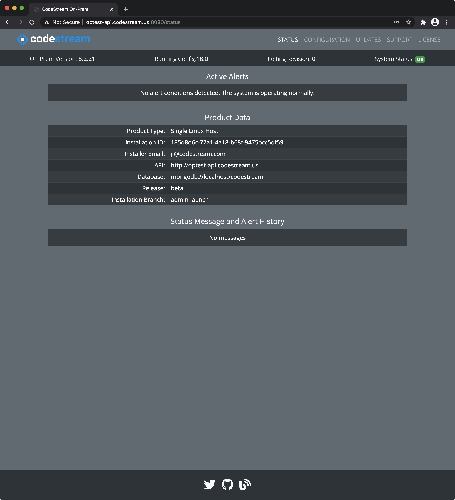
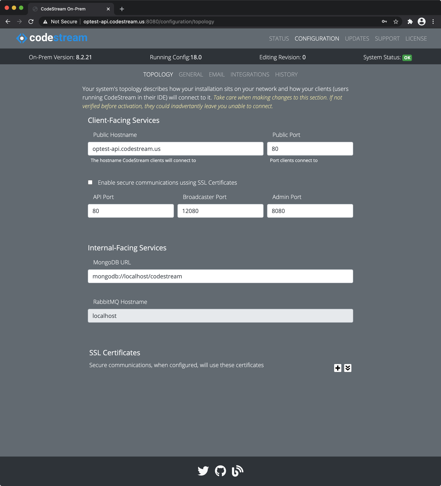

Recently, we've added an administrative service and browser app to the On-Prem
product. It offers a status monitor which reports any problems with the
services, shows support and license information and provides a configuration
editor.

When you install **CodeStream On-Prem**, the final step is to use the admin app
to register an administrator account email address and password. You can think
of this as a **root** account associated with the installation. It is not
related to your CodeStream user accounts. **The email address togther with your
auto-generated installation Id are important for paid support and licensing.**

When you login to the admin app for the first time, you're presented with the
status page containing salient information about your installation including
any alerts requiring your attention.

 

The admin app is organizad as follows.

## Main Navigation (Sections)

The main navigation organizes the app into these sections.

*	**Status** displays system information and alerts.
*   **Configuration** allows for saving, loading and activating system
    configuration settings.
*   **Updates** provides information about keeping your system up to date. Due
    to the nature of CodeStream's deployment as an extension which operates in a
    3rd party IDE, it's very important you stay current.
*   **Support** display more detailed data about your installation that may be
    useful to support.
*	**License** shows your operating license.

## OmniBar

The black bar beneath the main navigation is the OmniBar. It provides
information about the configuration you're editing, the version and rolled up
system status and any context sensitive buttons (such as **Save Changes** if
you've made pending changes to the configuration).

## Configuration Schema Version and Revisions

In order to maintain compatibility with the CodeStream software as it progresses
over time, the configuration is tied to a versioned schema which is used to
ensure that the source code and configuration are compatible. This **Schema
Version** is bumped (increased) as needed. It is not tied to any particular
release schedule. When the schema is bumped, the api server will migrate your
current schema version to the new one automatically.

Within a particluar schema, you can make revisions (sets of changes) to the
configuration. You can then **activate** any of the configurations matching the
schema version of the code you're running. Any revision activation requires a
system restart to take effect.

The **Running Config** property in the Omnibar, for example **17.2**, indicates
you're using the second revision of the configuration for schema version 17.
When a release upgrades the schema to version 18, your active 17 revision will
be migrated to schema version 18 as revision 0 which will be activated. The
schema 17 revisions will no longer be usable.

## Configuration Editor

The **Configuration** has its own sub-navigation bar which organizes
configuration editing into these sections.

 

 

*   **Topology** maps out the how the On-Prem server respons on the network to
    your CodeStream users. The topology dictates how traffic is routed, which
    ports are used, HTTPS/TLS certificates and settings, etc.
*	**General** miscellaneous configuration options.
*   **Email** let's you optionally configure outbound email. CodeStream supports
    both **SMTP** and **SendGrid**. Invites, alerts & usage reports are some of
    the benefits.
*   Some **Integrations** are configured at the server level and require the
    On-Prem Administrator to setup applications or keys wthin the target
    services and record the ID's and secrets in the On-Prem configuration.
*   **History** shows all the config revisions for the current schema as well as
    the **active** one. **_It is possible that an activated configurations is
    not currently running, as in the case where you just activated it but
    haven't restarted services yet.  The Running Config in the omnibar always
    shows the one in use._**

## Saving and Activating Changes

As soon as you make any changes to whichever config is loaded (by default, this
is the active configuration), you'll see a blue **Save Changes** button appear
in the OmniBar.

 

 

This indicates you have unsaved changes. Once you've made all of your changes,
click the **Save Changes** button to bring up the **Save Modal**.

 

 

Type in a brief description (this is required) and press either **Save** or
**Save and Activate**. This will create a new revision of the config. Remember
that you must restart the services before any activation takes effect.

If you go to the **Configuration > History** pane, you can see your new
revision, verify its activation or change the activated config.  Changing the
activated config happens instantly; there's nothing to _save_.

 

 

Hopefully, this gives you an overview of the Admin App and how to use it.
Details about the configuration options and procedures are documented throughout
this guide.
