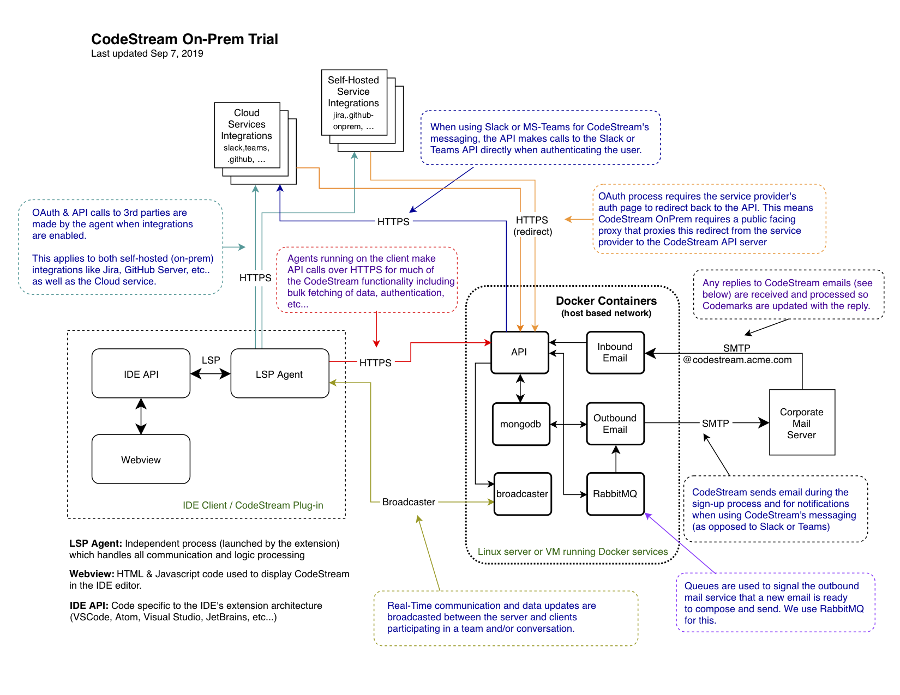

## Services

**CodeStream On-Prem** is made up of a number of services that run on the
_backend_. Clients, extensions that run in the IDEs, connect to two of them.
These services are:

1.  The **MongoDB service** is where all CodeStream data resides. This is what
    needs to be protected to ensure you don't loose any of your valuable
    information.

1.  The **API service** is the primary end point for access to the database and
    connections from the Client IDEs, implementing the server-side logic. This
    is an HTTP server.

1.  The **Broadcaster** handles real-time client/server broadcast messaging
    which ensures the timeliness of information as it moves through the system.
    The broadcaster uses **websockets** within the HTTP protocol. Client
    extensions connect to this service, along with the API.

1.  The **Outbound Email service** generates email messages and passes them to
    whichever email system you've configured for outbound email delivery.

1.  **RabbitMQ** provides a queuing mechanism used between the backend services
    to communicate tasks.

1.  The **~/.codestream/** directory on the host OS, while not a service in and
    of itself, gets a special mention here. This is the one directory tree you
    should be backing up regularly (in addition to doing your mongodb backups)
    to ensure you can recover all of your data in the event of a catestrophic
    failure. Make sure you store your backups somewhere _other than_ on the
    linux host OS or bare metal server on which it resides. You should consider
    georgraphically independent storage as well.

## Traffic Flow

This diagram shows the flow of traffic between the backend services and clients.

