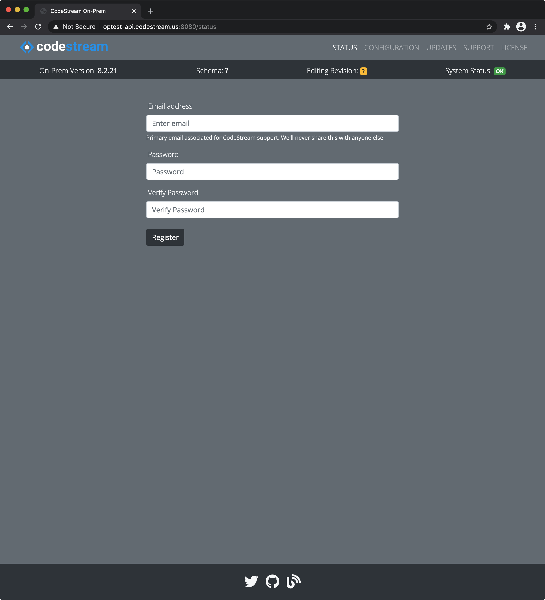

import DocsetMenu from './components/docset-menu';

**CodeStream On-Prem** is a docker-ized version of the CodeStream Cloud services
which you can install and operate entirely on your own hardware (or cloud
service provider). You only need a linux host OS running Docker.

Each new installation includes a trial license to get you started.

## Quick Start
<!--
<iframe width="560" height="315" src="https://www.youtube.com/embed/ehPdn937674"
frameborder="0" allow="accelerometer; autoplay; clipboard-write;
encrypted-media; gyroscope; picture-in-picture" allowfullscreen></iframe> -->
<center>
	<iframe width="420" height="236" src="https://www.youtube.com/embed/ehPdn937674"
	frameborder="0" allow="accelerometer; autoplay; clipboard-write;
	encrypted-media; gyroscope; picture-in-picture" allowfullscreen></iframe>
</center>

<br />

1.	Prepare a linux server or VM (referred to as the host OS) with
	[docker](https://runnable.com/docker/install-docker-on-linux). Make sure the
	unix user you login to it with is able to run docker commands _without_
	using **sudo**. We recommend you do _not_ use **root**. **CodeStream** uses
	5+ docker containers, one of which is mongodb, so we recommend a minimum of
	8Gb RAM, 16-24Gb of disk, and a decent amount of cpu horsepower. For AWS
	customers, we recommend an instance type of t3.large or more (preferrably
	t3.xlarge) when trying it out. Expect requirements to vary with workload.

1.	Developers running the CodeStream extension in their IDE must be allowed
	to make requests of the CodeStream server using **HTTP(S)** on ports
	**80(443)** and **12080(12443)**. You, the installer, must also be able to
	access the CodeStream server on ports **8080(8443)** and, of course, **ssh**
	into it for a terminal running a shell.

1.	Cut and paste these commands into your shell on the host OS. They will
	download and run the control script which will save a few configuration
	on the host OS, download the docker images and startup CodeStream.
	```
	mkdir ~/.codestream
	cd ~/.codestream
	curl -s -O https://raw.githubusercontent.com/TeamCodeStream/onprem-install/master/install-scripts/codestream
	chmod +x codestream
	~/.codestream/codestream --quickstart

	```

1.	In your web browser, go to the admin server (its URL was the last line
	printed to your terminal following the quickstart you just performed), and
	enter your email address and a password. This is the email address you'll
	use to engage support when you need help; it will not be tied to a
	CodeStream account although you can setup a CodeStream account with the same
	address if you want. Assuming you didn't use custom options, it will be the
	CodeStream server's IP address on port 8080, like this;
	`http://10.23.45.67:8080`.

	

1.	Each person using CodeStream must first, of course, install the extension
    from the IDE marketplace and then modify the settings to specify your
    CodeStream server's API URL, also displayed to the terminal following the
    quickstart. Assuming you didn't use custom options, it will be the
    CodeStream server's IP address like this; `http://10.23.45.67`.

1.	[Register a new account and start making
	codemarks](https://docs.codestream.com/userguide/gettingStarted/create-a-team/)!

It's important to keep your On-Prem installation up to date by [running these
commands](configs/single-host-linux#update-your-system-to-the-latest-version)
periodically. For more information about managing your installation, see the
[Single Linux Host](configs/single-host-linux) page.

**If you intend to run CodeStream On-Prem in an _Air Gapped_ configuration (on a
host that is not connected to the Internet), [follow these
instructions](faq/airgapped).**


## Help & Feedback

*	Report a bug or send a suggestion in [GitHub
	issues](https://github.com/TeamCodeStream/CodeStream/issues).

*	Contact us directly at [support@codestream.com](mailto:support@codestream.com).

*	Follow [@teamcodestream](http://twitter.com/teamcodestream) for product updates and to
	share feedback and questions.

## More Resources

<DocsetMenu />
