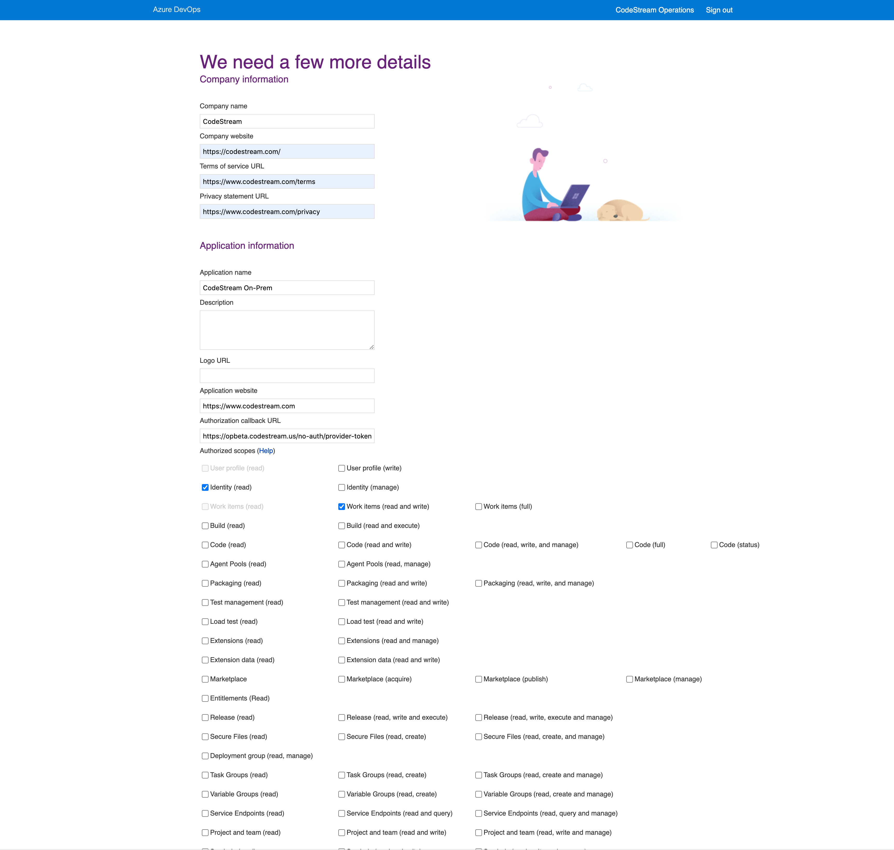
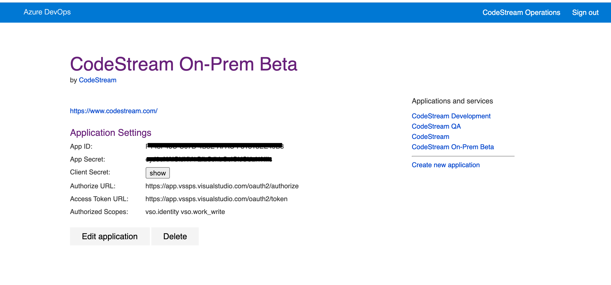
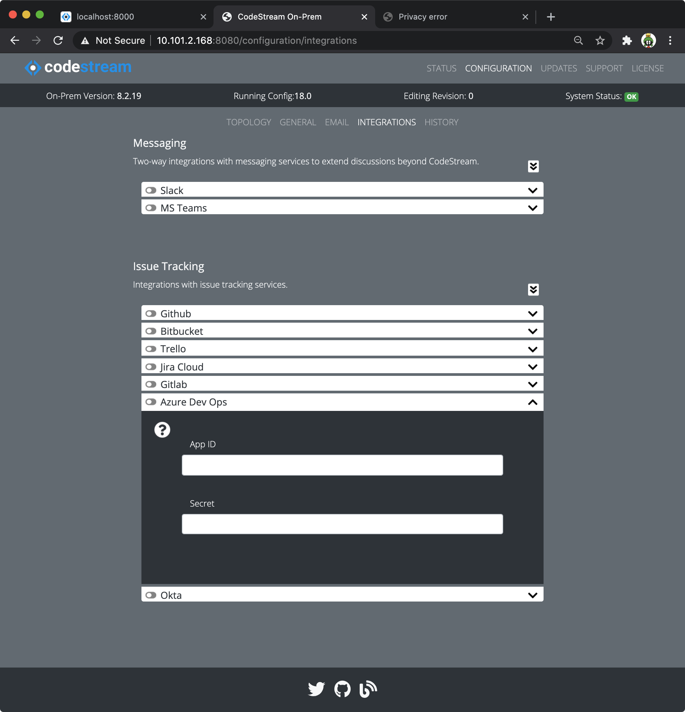

Integration with Azure DevOps requires an App to supply credentials for
accessing the Microsoft DevOps REST API. As an Admin, you'll create this App and
add its credentials to the CodeStream On-Prem configuration file. When a
CodeStream user connects to Azure DevOps, they'll provide a DevOps oragnization
and authorize this app for it.

## Login to Azure DevOps and Register an App

[Login to Azure DevOps](https://devops.azure.com). Once logged in, click on this
link to [register a new app](https://app.vsaex.visualstudio.com/app/register).

<!--  -->
 

Complete all the required fields. Make sure the **Identity (read)** and **Work
Items (read and write)** scopes are checked. _NOTE: You cannot change the scopes
once the app is registered._ Make sure your callback URL matches your CodeStream
On-Prem hostname with this path:
`https://codestream-onprem.mycompany.com/no-auth/provider-token/azuredevops`.
Once the form is complete, Click the **Register** button at the bottom of the
page.

## Get the App Credentials

After you register the app, you'll be presented with a page similar to this.

Take note of the **App ID** and **Client Secret** (do not confuse this with the
App Secret which is not needed; click the **show** button for this).

## Update your CodeStream configuration and Restart

*	Using your web browser, launch the Admin App (usually on port 8080 or 8443
	on your CodeStream On-Prem server). Login if need be.

*   Navigate to the **Configuration > Integrations** pane, open the DevOps
	integration accordion and add the app data.

	

*	After making your edits, [follow these instructions to save your
	changes](../adminapp/#saving-and-activating-changes) and **make sure you
	activate the new configuration**.

*	Finally, [restart the services](../configs/single-host-linux/#retart-the-services).

Instruct your users to _Reload_ their IDEs. They should now be able to connect
to Azure DevOps.
