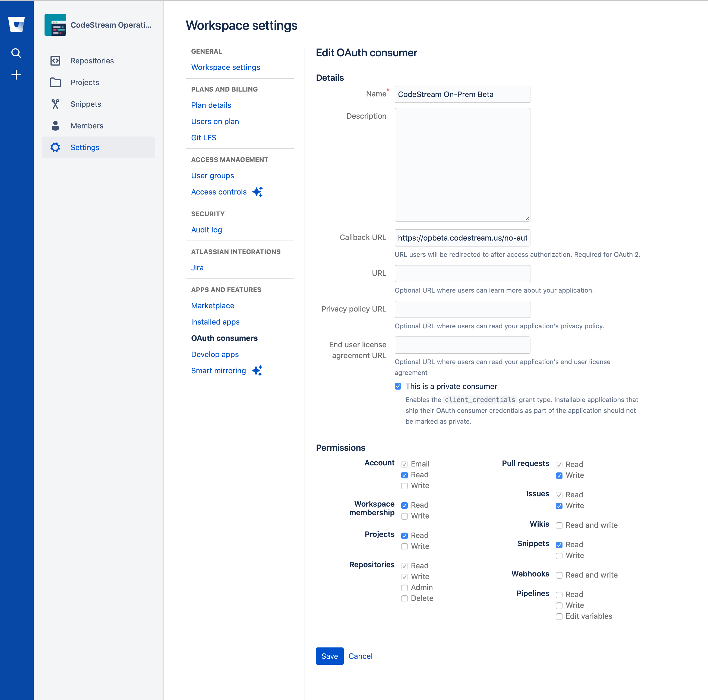

To get the CodeStream BitBucket integration working, you'll need to login to
your Bitbucket account and add an OAuth consumer to the Workspace which holds
your repositories.

## Login to BitBucket and Go to the Workspace Settings Page

[Login to BitBucket](https://bitbucket.org), click on your user icon on the
lower left of the screen and select the Workspace you want to connect to.

 
<!--  -->

Navigate to the **Settings** page, and then the **OAuth Consumers** page.

## Add a new OAuth Consumer

Press the **Add consumer** and complete the form. Take note of the permissions
required in this image and make sure you use your company's CodeStream On-Prem
hostname with this path for the Redirect URL:
`https://codestream-onprem.mycompany.com/no-auth/provider-token/bitbucket`

Then **Save** the consumer.

Lastly, click on it in the list to expose the key and secret. You'll need them
for the next step.

## Update your CodeStream configuration and Restart

*	Using your web browser, launch the Admin App (usually on port 8080 or 8443
	on your CodeStream On-Prem server). Login if need be.

*   Navigate to the **Configuration > Integrations** pane, open the bit bucket
    integration accordion and add the app data.

	

*	After making your edits, [follow these instructions to save your
	changes](../adminapp/#saving-and-activating-changes) and **make sure you
	activate the new configuration**.

*	Finally, [restart the services](../configs/single-host-linux/#retart-the-services).

Instruct your users to _Reload_ their IDEs. They should now be able to connect
to Bitbucket.
