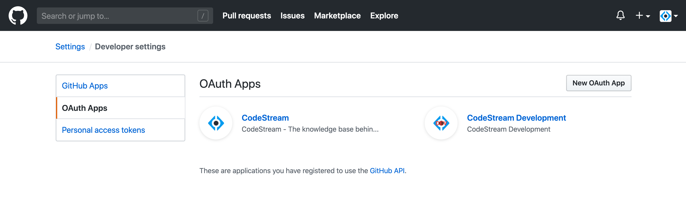
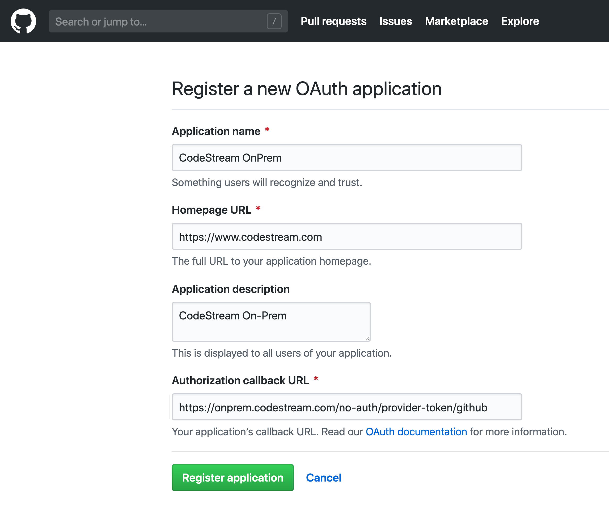
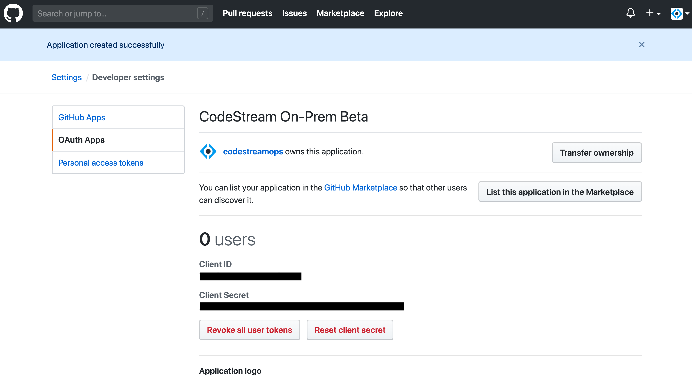
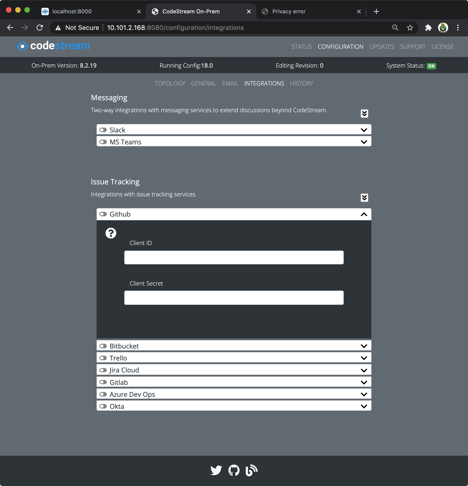

In order to integrate with Github.com you'll need to create an OAuth App which
will enable your CodeStream On-Prem server to use the Github REST APIs.

## Login to GitHub and Navigate to OAuth Apps

First [Login to GitHub](https://github.com), then go to your Settings page:

 

Then select **Developer Settings**

 

And finally **OAuth Apps**

## Register a new OAuth App

Press the **New OAuth App** button and complete the registeration form. Make
sure your callback URL references your company's CodeStream On-Prem hostname with
this path:
`https://codestream-onprem.mycompany.com/no-auth/provider-token/github`

<!--   -->

Then press the **Register application** button.

After you register the application, click on it to expose the client ID and
client secret. You'll need it for the next step.

## Update your CodeStream configuration and Restart

*	Using your web browser, launch the Admin App (usually on port 8080 or 8443
	on your CodeStream On-Prem server). Login if need be.

*   Navigate to the **Configuration > Integrations** pane, open the bitbucket
    integration accordion and add the app data.

	

*	After making your edits, [follow these instructions to save your
	changes](../adminapp/#saving-and-activating-changes) and **make sure you
	activate the new configuration**.

*	Finally, [restart the services](../configs/single-host-linux/#retart-the-services).

Instruct your users to _Reload_ their IDEs. They should now be able to connect
to Github.
