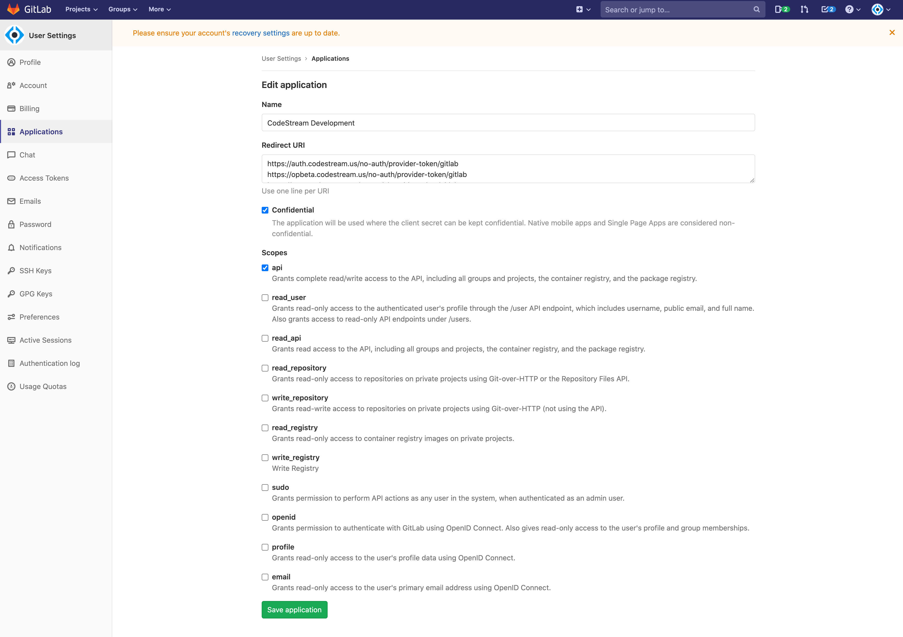
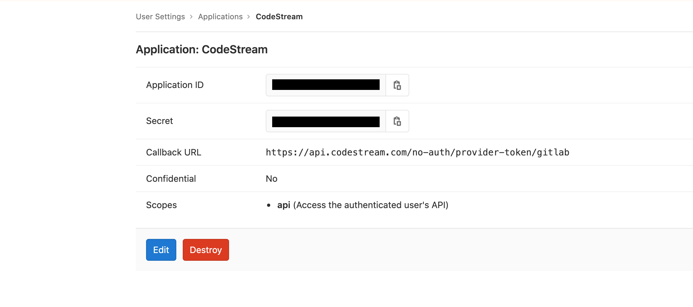
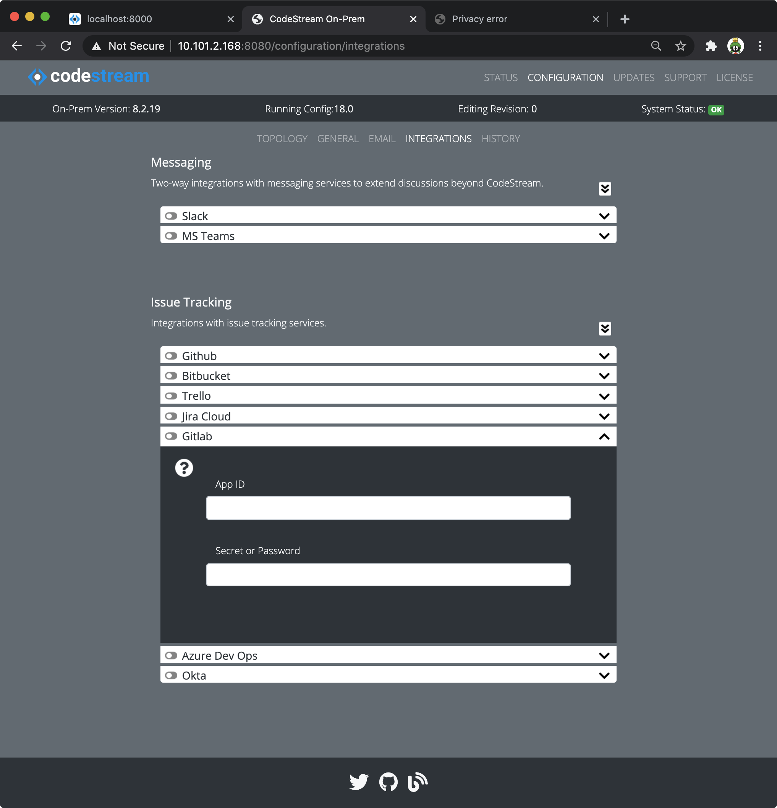

For the CodeStream Gitlab integration, you'll need to create a new Application
in your gitlab account to provide access to the Gitlab API.

## Login to Gitlab and Go to the Applications page

[Login to gitlab](https://gitlab.com), click the dropdown under your user icon
in the upper right and select **Settings**.

 

The select **Applications** on the left nav bar to expose the **New
Application** form.

## Create the Application

Complete the form pictured above. Make sure you check the **api** scope, and
optionally, the **Confidential** scope. The redirect URL should reference your
company's CodeStream On-Prem hostname with this path:
`https://codestream-onprem.mycompany.com/no-auth/provider-token/gitlab`

When you're done, click the **Save application** button.

After you create the application, click on it in the list to expose the
application ID and secret. You'll need it for the next step.

## Update your CodeStream configuration and Restart

*	Using your web browser, launch the Admin App (usually on port 8080 or 8443
	on your CodeStream On-Prem server). Login if need be.

*   Navigate to the **Configuration > Integrations** pane, open the Gitlab
    integration accordion and add the app data.

	

*	After making your edits, [follow these instructions to save your
	changes](../adminapp/#saving-and-activating-changes) and **make sure you
	activate the new configuration**.

*	Finally, [restart the services](../configs/single-host-linux/#retart-the-services).

Instruct your users to _Reload_ their IDEs. They should now be able to connect
to Gitlab.
