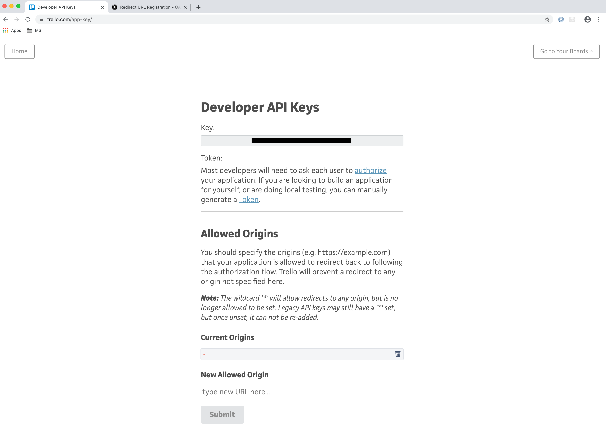
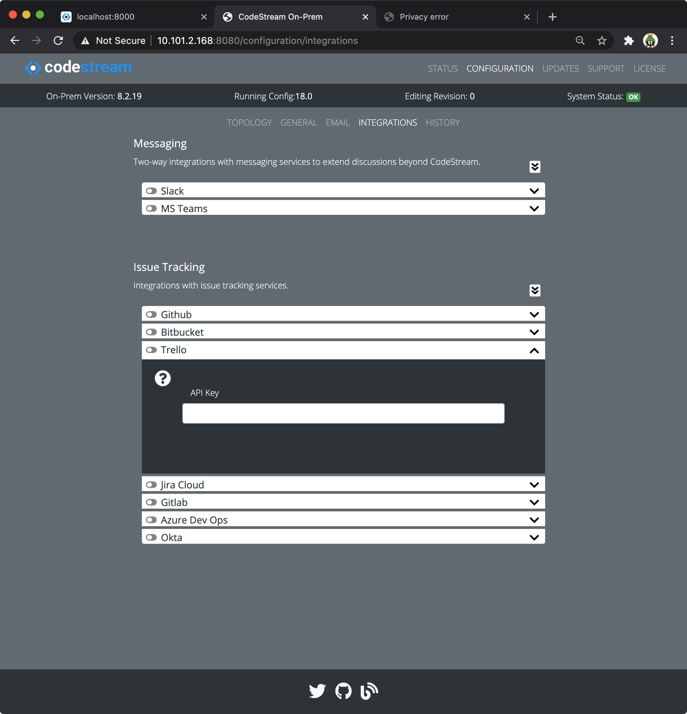

Configuring CodeStream to integrate with Trello is a bit different than the
other services. Trello provides a Developer API Key to all accounts. You cannot
change it.

## Login to Trello and Navigate to the Developer API Key Page

[Login to trello](https://trello.com) using the account whose Developer Key you
wish to use for integrating with CodeStream. Once you're logged in, you can see
your key by going to https://trello.com/app-key/ .

## Update the Origins

Add your CodeStream On-Prem server callback URL as a **New Allowed Origin**. The
redirect URL should reference your company's CodeStream On-Prem hostname with
this path:
`https://codestream-onprem.mycompany.com/no-auth/provider-token/trello`

## Update your CodeStream configuration and Restart

*	Using your web browser, launch the Admin App (usually on port 8080 or 8443
	on your CodeStream On-Prem server). Login if need be.

*   Navigate to the **Configuration > Integrations** pane, open the Trello
    integration accordion and add the app data.

	

*	After making your edits, [follow these instructions to save your
	changes](../adminapp/#saving-and-activating-changes) and **make sure you
	activate the new configuration**.

*	Finally, [restart the services](../configs/single-host-linux/#retart-the-services).

Instruct your users to _Reload_ their IDEs. They should now be able to connect
to Trello.
