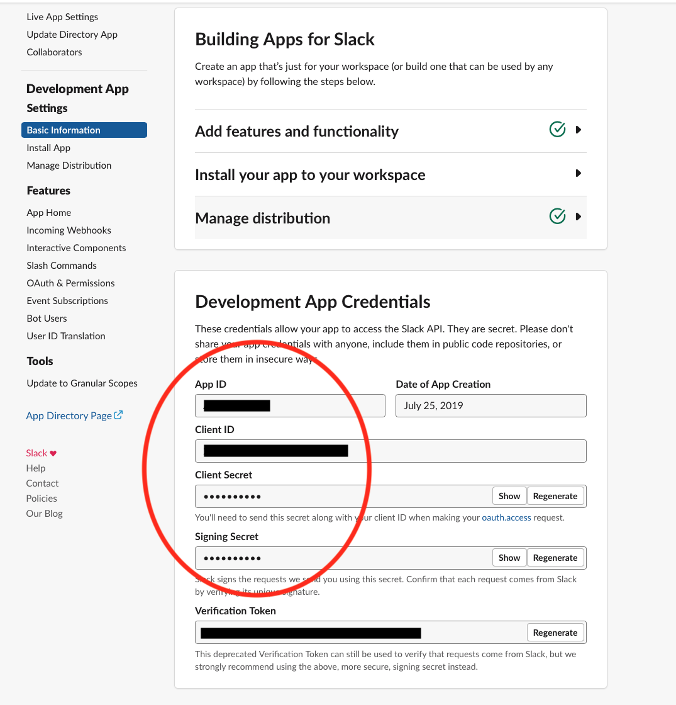
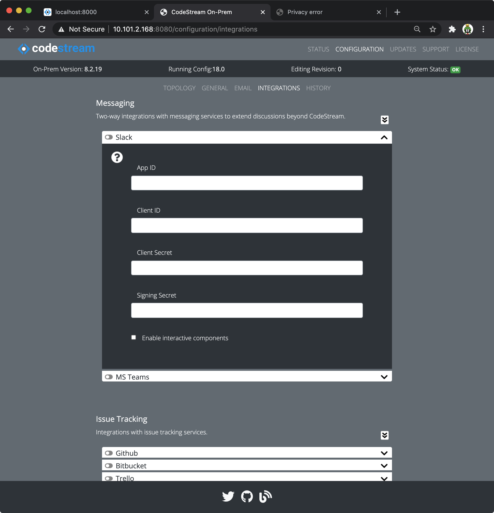
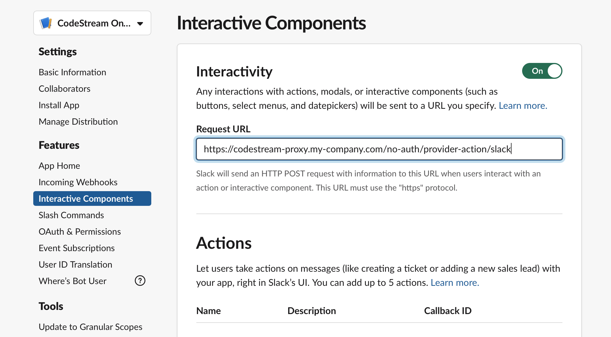

CodeStream's Slack integration allows you to share your codemark comments inside
Slack channels. If you want to allow users to also be able to reply from Slack,
you will need to expose your CodeStream API service to listen from requests made
by Slack's bot framework. In this case, review the [network
configuration](network) page for more information.

All requests made by slack are signed and verified using [Slack's procedure for
doing so](https://api.slack.com/docs/verifying-requests-from-slack). This
mitigates security concerns for the publicly available routes.

## Slack Access without a publicly accessible CodeStream API

Complete these steps to setup a basic Slack integration which allows CodeStream
users to share codemarks on Slack channels without accepting any replies from
Slack.

1. Create a Slack App for connecting CodeStream. You will add this app to any
	 workspace(s) you wish to share codemarks to.
	*	Go to https://api.slack.com/apps, make sure you're logged in to your
		workspace with administrative privileges, and press **Create New App**. We
		recommend naming it **CodeStream OnPrem**.
	*	On the **OAuth & Permissions** page, in the **Scopes** section add the
		**Confirm user’s identity (identity.basic)** scope and press the "Save
		Changes" button.
	*	Also on the **OAuth & Permissions** page, in the **Redirect URL's**
		section, add the URL
		`https://<your-codestream-host>/no-auth/provider-token/slack`
		and press the "Save URLs" button (substitute your codestream hostname
		here).
	*	On the **Basic Information** page, install the App into your workspace 
	*	Distribute the app (this does NOT submit it to the Slack App Directory).
		On the left rail under settings, select **Manage Distribution**. On the
		middle of that page press the `"Activate Distribution"` button (you may
		need to check off a few items on the checklist below to make that button
		available). Since you won't be submitting the App to the Slack App
		directory, these values don't really matter.

1. Update your CodeStream configuration.
	 
	*	Go to your [Slack App configuration](https://api.slack.com/apps), navigate
		to the **Basic Information** page and take note of the 4 identifiers and
		secrets of your slack app.
		
		<!--  -->

	*	Using your web browser, launch the Admin App (usually on port 8080 or 8443
		on your CodeStream On-Prem server). Login if need be.

    *   Navigate to the **Configuration > Integrations** pane, open the Slack
        messaging integration accordion and add the app data.
		

	*	After making your edits, [follow these instructions to save your
		changes](../adminapp/#saving-and-activating-changes) and **make sure you
		activate the new configuration**.

	*	Finally, [restart the services](../configs/single-host-linux/#retart-the-services).

## Add Interactive Components access for your CodeStream Slack App

For the richest experience, you need to allow Slack's servers to make https
calls to your CodeStream API container. This means making particular routes on
your CodeStream API available to the public. [Slack requests are
signed](https://api.slack.com/docs/verifying-requests-from-slack) so attack
vectors are minimized.

Whomever governs your network infrastructure will likely have requirements on
how to do this. Review the [network configuration](network) page for more
information.

Once your network is properly configured to expose your CodeStream On-Prem API
you should know the public fully qualified public facing hostname which you'll
need for the next step.

1.  Complete the [section
    above](#slack-access-without-a-publicly-accessible-codestream-api), save &
    activate the configuration but don't restart your services yet.

1.	Add the Interactive Callback To Your Slack App

    Go to your [Slack App configuration](https://api.slack.com/apps), navigate
    to the **Interactive Components** page and update the **Interactivity**
    section with your publicly facing Slack route. To continue the example from
    above, you would use:
    `https://codestream-proxy.my-company.com/no-auth/provider-action/slack`

    

1.	Now restart your CodeStream services as specified above.

**You're Done!** CodeStream users can share their codemarks with Slack and Slack
users can now participate in codemark discussions by pressing the `View
Discussion & Reply` button in the Slack posts. These replies will be funneled
back into your CodeStream On-Prem installation.
