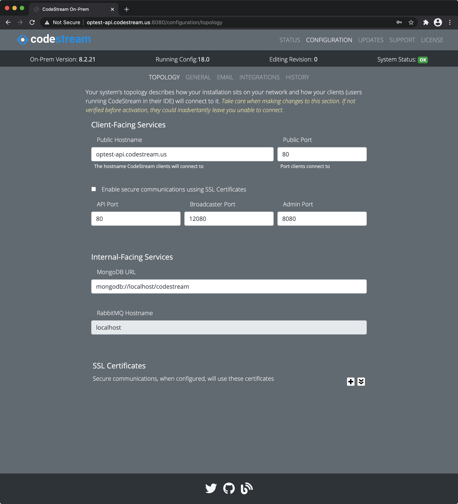

While CodeStream On-Prem does not support service level redundancy, some
customer installations require the use of an Elastic Load Balancer to support
their network's topology.

Here we demonstrate two configurations; both using a V2 Elastic Load Balancer,
also known as an Application Load Balancer. The examples show an internet-facing
load balancer with the CodeStream On-Prem instance running on a private subnet.
One configuration is for running CodeStream on the default insecure ports of 80
and 12080 (HTTP scheme). The other shows CodeStream running on ports 443 and
12443 with a valid SSL certificate configured on the load balancer's listeners
and a self-signed certificate running on the EC2 instance (HTTPS scheme).

We've also supplied two CloudFormation templates (one for each config) which you
can download and modify to create the load balancer and related resources.

## Prerequisite Work

Before setting up load balancing, make sure you follow the [QuickStart](../)
procedure to get your EC2 instance up and running with CodeStream. The
QuickStart procedure calls for the instance to have a resolvable hostname which
has been added to the **codestream-services-config.json** configuration file.

1.  Make sure the hostname resolves properly on the instance itself and the
    services are responding to it. The grep command will show the probed
    hostname, the second will verify it's working:
	```
	grep publicApiUrl ~/.codestream/codestream-services-config.json
		"publicApiUrl": "http://qs1.codestream.us",
	curl http://qs1.codestream.us/no-auth/status; echo
	OK
	```
	
1.  Determine the following resource information. You'll need it in later steps.
    *   The Id of your VPC (vpc-xxxxx)
    *   Two public subnet Id's, one of which must be in the same AZ as the
        CodeStream OnPrem instance (subnet-xxxxx)
    *   For secure configurations, the SSL Cert ARN you will be configuring on
        the load balancer (**arn:aws:acm:\<region\>:\<account\>:...**)
    *   The CIDR block of your CodeStream clients
    *   The CIDR block or host IP (/32) of requests comming from your CodeStream
        OnPrem EC2 instance. If your instance is running on a private subnet,
        this will likely be one or more of the NAT Gateway's configured for
        outbound traffic.  The docker containers will make requests that will
        route to the load balancer.


## Setup an ALB using HTTP

In this section, we create the resources needed to provide external access to
both the API and Broadcaster through an application load balancer using HTTP on
ports 80 and 12080. The resources include the load balancer with two listeners,
two target groups (one of the API and one for the Broadcaster) and a security
group you can use for the load balancer.

### Create the resources with CloudFormation

[Download this cloud formation
template](https://github.com/TeamCodeStream/onprem-install/blob/master/config-templates/single-host-alb-insecure.json)
and fill in the fields surrounded with the `{{ ... }}` braces. Once you've
filled in those fields, you can use CloudFormation to create a stack for them.
Either upload the completed CloudFormation definition file via the AWS
CloudFormation console or create the stack using the **aws cli** as follows:
```
aws cloudformation create-stack --stack-name codestream-alb --template-body file://your-cf-file.json
```

### Create the resources with the EC2 Console

Or, if you'd prefer to use the AWS EC2 Console you can create the resources
manually.

1.	Create an Application Load Balancer
1.  Create two Listeners; one on port 80 for HTTP and one on port 12080 for HTTP
1.  Create two target groups for the Load Balancer; one for the API (port 80)
    and one for the Broadcaster (port 12080).  For the health checks, use
    **/no-auth/status** and status code 200.

### Determine the Load Balancer's public hostname

This is the hostname the clients will be configured to use to find CodeStream
via the load balancer. You can find it on the **Description** panel in the AWS
EC2 Console for the load balancer itself.  You may wish to create a DNS entry in
your company's DNS map (Route 53) as an Alias for the load balancer. You'll need
it to complete the configuration.

### Modify the CodeStream Configuration and Restart

1.  Using your web browser, launch the Admin App (usually on port 8080 or 8443
    on your CodeStream On-Prem server). Login if need be.

1.  Navigate to the **Configuration > Topology** pane and make your changes.
    
    Make sure the **Public API port** matches the load balancer while the **API
    Port** specifies the port used on the On-Prem server (listerner target).

1.  After making your edits, [follow these instructions to save your
    changes](../adminapp/#saving-and-activating-changes) and **make sure you
    activate the new configuration**.

1.  Finally, [restart the services](../configs/single-host-linux/#retart-the-services).

### Register the CodeStream instance with the Target Groups

Finally, register the CodeStream instance with both of the target groups (API
and Broadcaster). It should take 30 seconds or so for the load balancer to see
the targets as healthy. When both services show healthy you are ready to use
CodeStream.


## Setup an ALB using HTTPS

In this section, we create the resources needed to provide external access to
both the API and Broadcaster through an application load balancer using HTTPS on
ports 443 and 12443. The resources include the load balancer with two listeners,
two target groups (one of the API and one for the Broadcaster) and a security
group you can use for the load balancer. You will also need an SSL certificate
to assign to the Load Balancer's listeners.

### Create the ELB Resources

#### Create the resources with CloudFormation

[Download this cloud formation
template](https://github.com/TeamCodeStream/onprem-install/blob/master/config-templates/single-host-alb-secure.json)
and fill in the fields surrounded with the `{{ ... }}` braces. Once you've
filled in those fields, you can use CloudFormation to create a stack for them.
Either upload the completed CloudFormation definition file via the AWS
CloudFormation console or create the stack using the **aws cli** as follows:
```
aws cloudformation create-stack --stack-name codestream-alb --template-body file://your-cf-file.json
```

#### Create the resources using the EC2 Console

Or, if you'd prefer to use the AWS EC2 Console you can create the resources
manually.

1.	Create an Application Load Balancer
1.  Create two Listeners; one on port 443 for HTTPS and one on port 12443 for
    HTTPS.
1.  Create two target groups for the Load Balancer; one for the API (port 443)
    and one for the Broadcaster (port 12443).  For the health checks, use
    **/no-auth/status** and status code 200.

### Determine the Load Balancer's public hostname

This is the hostname the clients will be configured to use to find CodeStream
via the load balancer. You can find it on the **Description** panel in the AWS
EC2 Console for the load balancer itself.  You may wish to create a DNS entry in
your company's DNS map (Route 53) as an Alias for the load balancer. You'll need
it to complete the configuration.

### Modify the CodeStream Config File and Restart

You cannot use HTTPS between the CodeStream clients and the load balancer along
with HTTP between the load balancer and the services running on the host OS. You
must configure the host OS to use SSL but you can create a self-signed
certificate on the host OS to accomplish this.

The CodeStream control script can create the key and certificate but you must
have **openssl** installed on the host OS. It's usually pre-installed on Amazon
Linux but packages exist for all Linux distributions.

To create your own self-signed cert using the codestream script, with
**openssl** installed on the host OS, run this command:
```
~/.codestream/codestream --make-self-signed-cert
```

Once you have your key and certificate (and optional bundle file), [follow these
steps to install it](ssl) and restart.

### Register the CodeStream instance with the Target Groups

Finally, register the CodeStream instance with both of the target groups (API
and Broadcaster). It should take 30 seconds or so for the load balancer to see
the targets as healthy. When both services show healthy you are ready to use
CodeStream.
