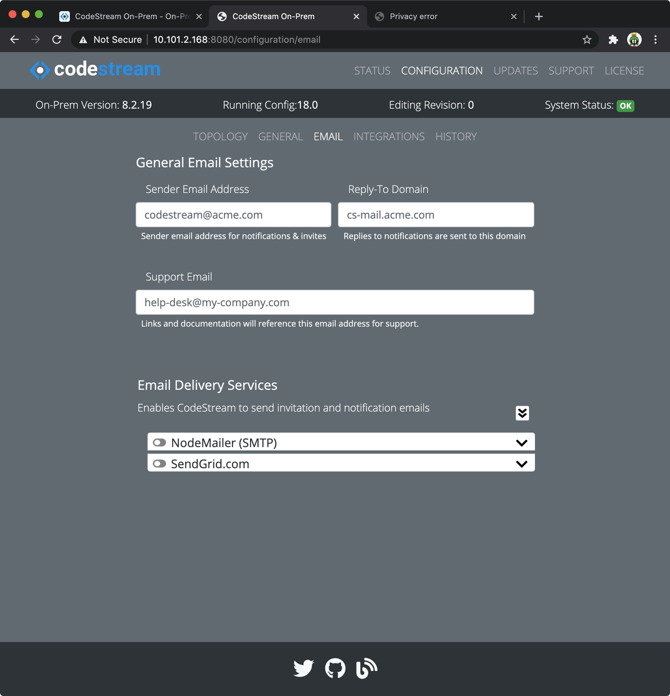
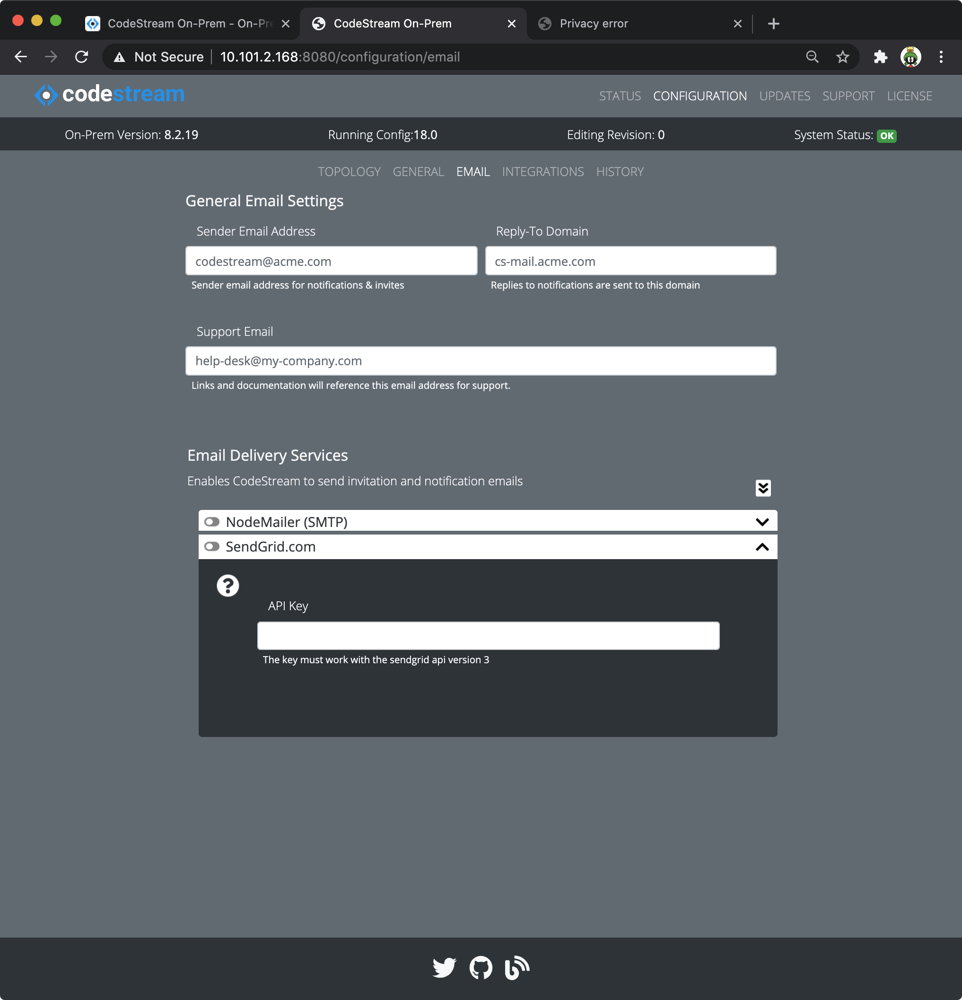
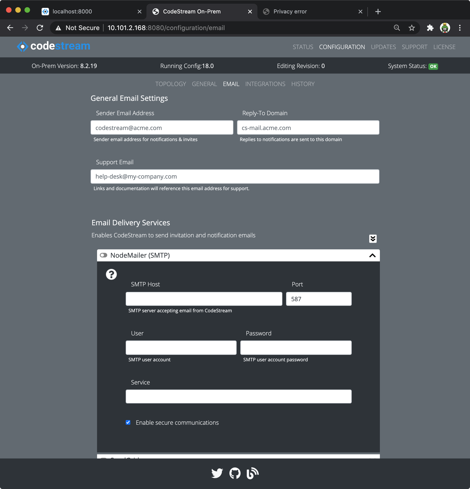

CodeStream generates email for invitiations, notifications and more. The
outbound email service processes email requests, composes the content and
headers and passes it to your chosen email delivery service for sending. Since
you need to confirm your email address as part of the registration process, the
outbound email service is a requirement for running CodeStream On-Prem.

CodeStream supports two email sending engines; standard SMTP servers using the
npm [NodeMailer](https://www.npmjs.com/package/nodemailer) library or
[Sendgrid](https://sendgrid.com), a 3rd party cloud-based emailing service.

## Open up the Admin App

1.  Using your web browser, launch the Admin App (usually on port 8080 or 8443
    on your CodeStream On-Prem server). Login if need be.

1.	Navigate to the **Configuration > Email** pane.
	

## Sendgrid

For Sendgrid, you will need an account on their system. They are a pay service
but prices are reasonable. They offer reliability and excellent reporting and
troubleshooting. If you require that 100% of your installation operates on your
wires this will not be an option for you.

1. Login to your sendgrid account on the web and [generate an API
   key](https://app.sendgrid.com/settings/api_keys)

1.  Expose the Sendgrid accordion and enter in your API key.
	

## GMail/G-Suite SMTP Relay

G-Mail/G-Suite allows you to send email from your account through 3rd party
software as long as you have account credentials and you configure the _enable
less secure apps_ option within your account. _It's worth noting that Google has
since end-of-lifed this feature but they have not but an expiration date to it._

1. [Follow these instructions to enable less secure apps to send email using
   your Google account](https://support.google.com/accounts/answer/6010255)

1.  Expose the NodeMailer/SMTP accordion card and enter your G-Suite smtp
    information.
	

## Generic SMTP Relay

Use this option if your Email Adminstrator can provide an SMTP relay server
enabled to accept email from your CodeStream host OS.

1.  Expose the NodeMailer/SMTP accordion card and enter your SMTP information.
    

## Amazon SES with SMTP (via NodeMailer)

Amazon's Simple Email Service can be configured to accept email via the SMTP
protocol (in addition to the SES APIs). Below is a quick reference which should
get you started. That said, SES does have quite a few configuration options and
it is beyond the scope of this guide to document them.

[This is the entry page to configuring SES for
SMTP.](https://docs.aws.amazon.com/ses/latest/DeveloperGuide/send-email-smtp.html)

1. [Choose your end point (which is region specific) and
    port.](https://docs.aws.amazon.com/ses/latest/DeveloperGuide/smtp-connect.html)
    For this example, we'll use TLS which uses port **465**.

1. [Configure an IAM user to allow submission of
    email.](https://docs.aws.amazon.com/ses/latest/DeveloperGuide/smtp-credentials.html)
    When you follow the instructions you will get an AWS Access Key and email
    password. _Do not confuse the email password with the AWS Secret. They are
    different._  The IAM user requires the managed **AmazonSesSendingAccess**
    policy or similar:
	```
	"Statement": [
		{
			"Effect": "Allow",
			"Action":
			"ses:SendRawEmail",
			"Resource":"*"
		}
	]
	```

1. [Choose the sending email address you want to use and verify it with
   SES.](https://docs.aws.amazon.com/ses/latest/DeveloperGuide/verify-email-addresses-procedure.html)
   SES will send an email to it with a link you must confirm.

1.  Expose the NodeMailer/SMTP accordion card and enter your SMTP information.
    
    The **username** and **password** inputs refer to the SES user access key
    and password respectively. SES uses port 465 with secure transmission enabled.
    The **host** input is the regiion-specific SES endpoint you selected.

## Save your changes and Restart services

1.  After making your edits, [follow these instructions to save your
    changes](../adminapp/#saving-and-activating-changes) and **make sure you
    activate the new configuration**.

1.  Finally, [restart the services](../configs/single-host-linux/#retart-the-services).

