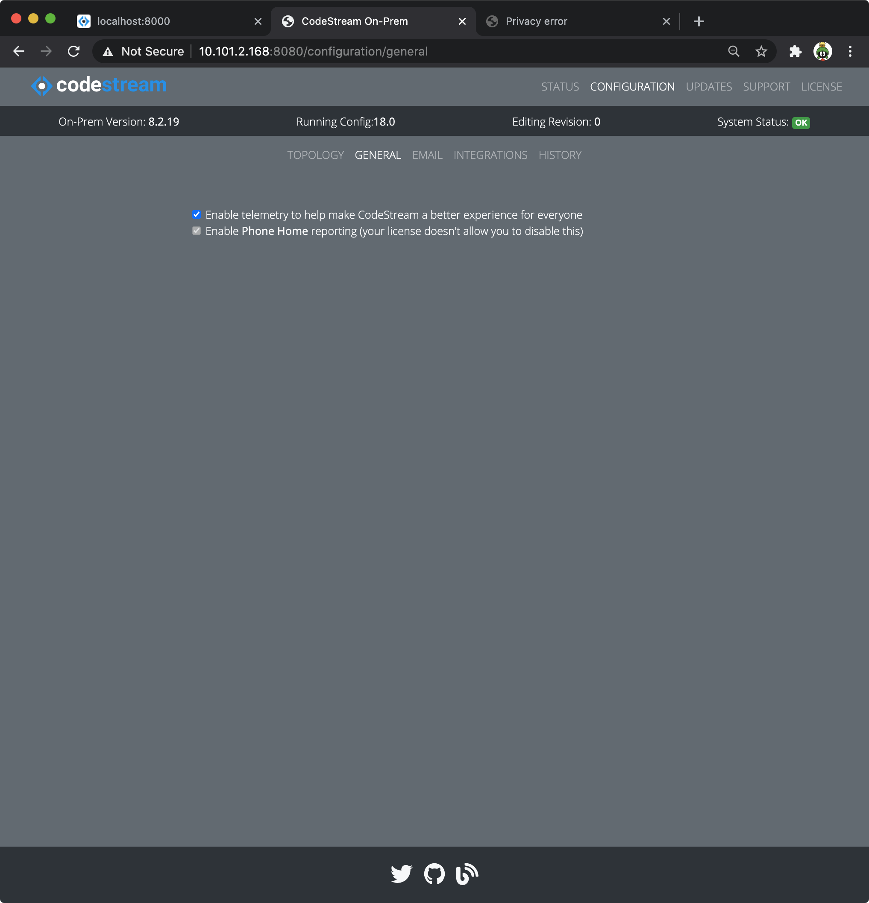

## Event-Based Telemetry

CodeStream uses Segment to monitor user behaviors in order to understand how our
customers are using the service, and where we can improve. User actions, such as
creating a codemark, requesting a code review, or sharing a codemark, are
recorded as they happen. In addition to the nature of the action, we also
collect some characteristics of the action. For example, did the code review
include unsaved changes, from where in the UI was the codemark initiated, or was
the codemark shared to Slack or Teams.

**Telemetry does include users' email addresses.** We will look to anonymize
this for on-prem customers in the near future, but for now if you aren’t
comfortable with email addresses being included you can turn off telemetry using
the Admin App. See below for more info.
## Nightly Phone Home

On-prem installations ping CodeStream on a nightly basis with summary
information about your installation and high-level activity in order to help our
product and customer teams. **For customers on CodeStream’s free or trial plan,
the phone home does also include users’ email addresses so that we are able to
contact you for support, updates and security notices.** If you upgrade to a
paid plan, email addresses will no longer included and you can turn off phone
home.

Here is the complete set of information included in the phone home.
```
- date 
- installationId 
- installationVersion
- outboundEmailEnabled
- slackInteractiveComponentsEnabled
- List of configured integrations (e.g., Slack, GitHub, Jira, etc.)
- Companies
    - id
    - name
    - isDeactivated
    - createdAt
    - creatorId
    - plan
- Teams
    - id
    - name
    - companyId
    - isDeactivated
    - createdAt
    - creatorId
    - liveView
    - codeReviewApproval 
    - codeReviewAssignment
- Users
    - id
    - email - Not included for companies on a paid plan
    - isRegistered
    - isDeactivated
    - isAdmin 
    - registeredAt
    - joinMethod
    - lastLogin
    - lastOrigin
    - lastOriginDetail
    - codemarks 
    - codemarksInReviews
    - reviews 
    - replies
- Code Reviews
    - teamId
    - reviewId
    - createdAt
    - approvedAt
```

## Changing the Telemetry and Phone Home Settings

Use the **Admin App** to modify your telemetry or phone home settings (if
allowed).

1.  Using your web browser, launch the Admin App (usually on port 8080 or 8443
    on your CodeStream On-Prem server). Login if need be.

1.	Navigate to the **Configuration > General** pane and make your changes.
	

## Save, Activate and Restart

1.   After making your edits, [follow these instructions to save your
    changes](../adminapp/#saving-and-activating-changes) and **make sure you
    activate the new configuration**.

1.  [Restart the On-Prem services](../configs/single-host-linux/#retart-the-services).
